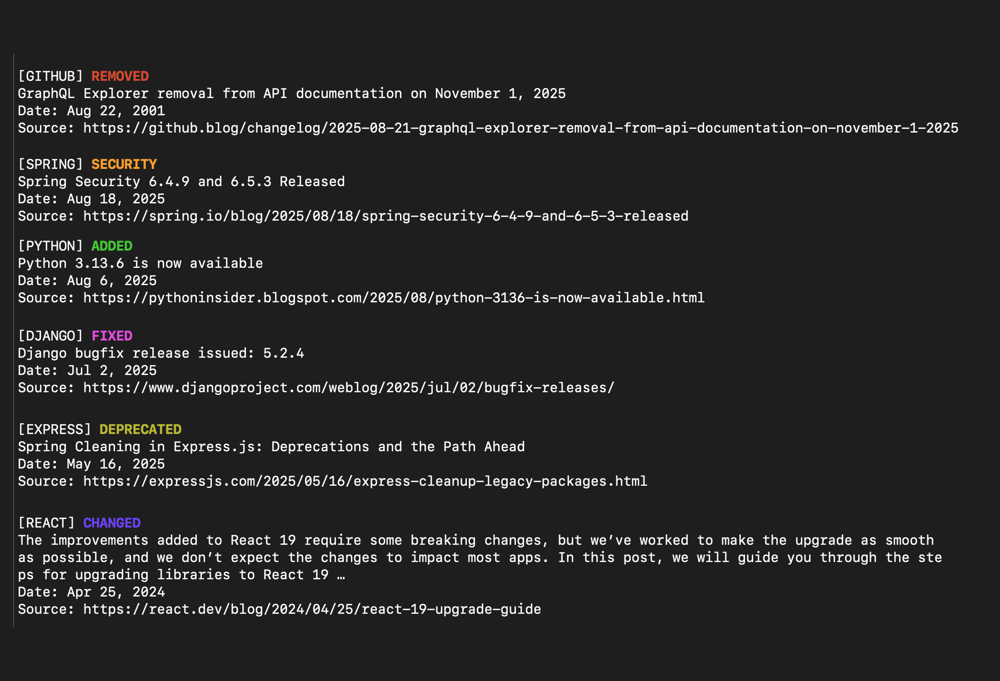

# [changelog.world](https://changelog.world/)



[changelog.world](https://changelog.world/) is a web application that displays tech changelogs and release notes in a developer-friendly format. Browse through the web interface or access directly through the terminal with CLI commands.

Supported: C++, Java, Spring, Next.js, GitLab, Python, PHP, Node.js, Django, Svelte, Express, Tailwind CSS, Swift, React, Vue.js, Vercel, GitHub.

## Features

- 🌐 **Web Interface**: Browse changelog entries with filtering by technology and type
- 🖥️ **CLI Access**: Direct terminal access via curl with pagination and limit support
- 📱 **Responsive Design**: Works on desktop and mobile devices
- 🌙 **Dark Mode**: Automatic dark/light mode support
- 🔍 **Smart Filtering**: Filter by technology categories and changelog types
- ⚡ **Fast Updates**: Fresh content updated regularly from official sources

## CLI

Access changelog data directly from your terminal using curl:

```bash
curl https://changelog.world/cli
```

### Options

- `page`: Page number (default: 1)
- `limit`: Number of entries per page (default: 10)
- `tech`: Technology (default: all)
- `type`: Type (default: all)

```bash
Pagination:  curl 'https://changelog.world/cli?page=<PAGE_NUMBER>'
Limit:       curl 'https://changelog.world/cli?page=1&limit=<1-50>'
Tech:        curl 'https://changelog.world/cli?tech=<TECH1,TECH2>'
Options:     cpp,java,spring,nextjs,gitlab,python,php,nodejs,django,svelte,express,tailwind,swift,react,vuejs,vercel,github
Type:        curl 'https://changelog.world/cli?type=<TYPE1,TYPE2>'
Options:     added,changed,deprecated,removed,fixed,security
```

### Examples

```bash
# Get latest 10 changelog entries
curl https://changelog.world/cli

# Navigate through changelog pages
curl 'https://changelog.world/cli?page=2'
curl 'https://changelog.world/cli?page=3'

# Limit the number of entries per page
curl 'https://changelog.world/cli?limit=20'

# Filter by technology
curl 'https://changelog.world/cli?tech=react'

# Filter by type
curl 'https://changelog.world/cli?type=added'

# Filter by technology and type
curl 'https://changelog.world/cli?tech=react&type=added'
```
